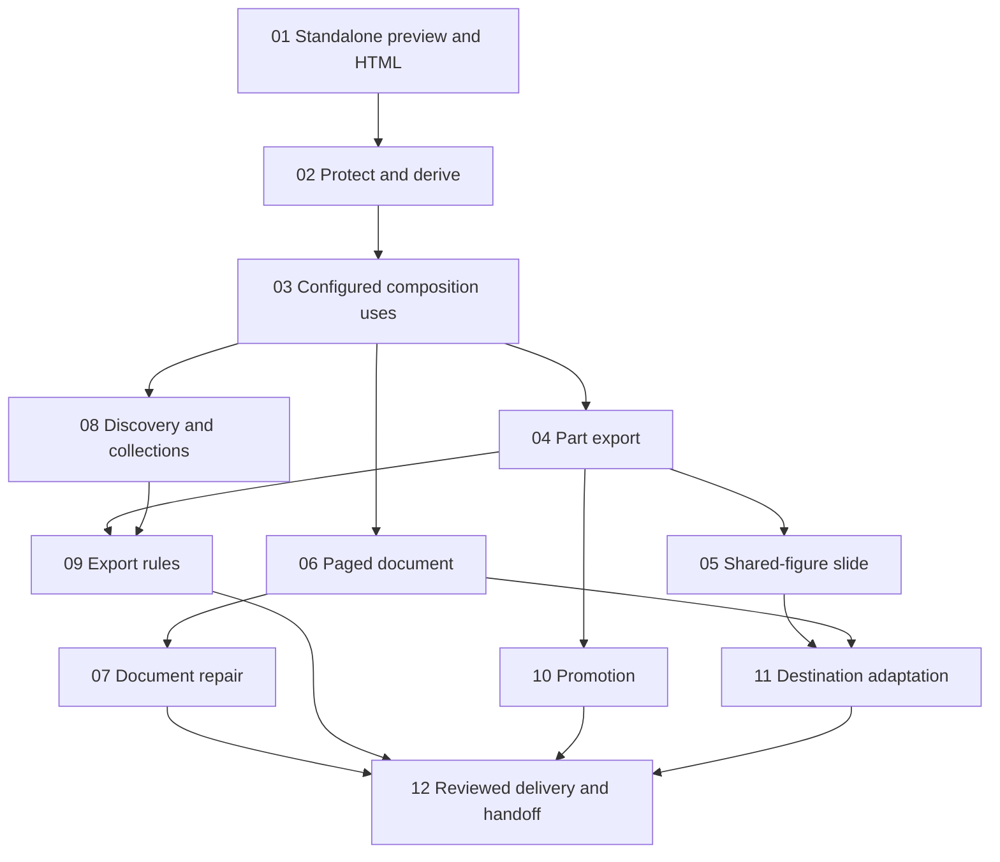

# Proposed ticket breakdown: first working slice

Review state: accepted as a starting point; publication deferred while the
development foundation is established.

This is a proposal for 12 tickets against the [first working-slice spec](spec.md).
The spec remains unchanged. After approval, publish each ticket separately with
the local tracker status `ready-for-agent`; execution starts only after its
listed blockers are done. These drafts are not published implementation tickets.

Each ticket delivers observable behavior through the public studio operations,
with the smallest relevant browser controls, behavioral tests, and inspection of
its actual outputs. The source remains authoritative and owner material stays
behind the documented extension contract. The proposed dimensions, example
topic, tools, storage, and packaging retain the status assigned in the spec.

The owner requested a [development foundation](../development-foundation/status.md)
before product implementation. Its evaluated toolchain, commands, and CI should
be reused by ticket 01; the neutral quality lab does not implement a public
studio contract. Review the setup criterion below against that foundation when
publishing the tickets. Tests, diagnostics, accessibility,
and output inspection belong to the ticket introducing the behavior; ticket 12
integrates and delivers the complete example rather than supplying deferred
coverage for earlier work.

## Quality-lab retirement

The owner agreed that the quality lab is bootstrap scaffolding. Preserve useful
neutral compositions as example workspace material or test fixtures, and move
checks onto real public studio behavior as each capability arrives. Remove
superseded lab implementations, UI, commands, and CI/build wiring in the ticket
that replaces them. Keep an unreplaced probe only for a named development need,
with its disposition assigned to a ticket below; equivalent product evidence
must exist before removing a check that still protects supported behavior.

Ticket 01 takes over preview, portable HTML, and the default development entry.
Ticket 04 takes over PNG and selected-part export probes. Ticket 06 resolves the
PDF probe against the actual document capability. Ticket 12 confirms that the
lab has been retired or that any retained development utility has an explicit,
continuing purpose. This adds no separate lab application or implementation phase.

## 01: Find, preview, and export a standalone draft figure

**What to build:** Start a local studio, find one neutral draft figure, compare
its two brand variations, and deliver portable static HTML from the same saved
source. This establishes an executable public authoring example before reuse.

**Blocked by:** Development foundation and review of the resulting stack evidence.
No preceding product ticket.

**Spec coverage:** Stories 1, 2, 12, 20, 21, 23-25, 41, 44, 46, 48, 50-51;
acceptance A1-A4, A12, A15-A16 for the standalone case.

- [ ] Reuse the evaluated Node/npm toolchain, locked dependencies, static checks,
  and clean-checkout CI from the development foundation. Update setup and commands
  for the actual studio; change the evaluated stack only for a demonstrated need.
- [ ] Make `npm run dev` open the studio. Adapt useful lab compositions into the
  neutral example workspace through public contracts. Move preview, variation,
  accessibility, resource-failure, and portable-HTML checks onto studio behavior;
  retire the replaced lab paths and assign any remaining probe to its ticket.
- [ ] Save a neutral brief with audience, purpose, message, destinations,
  dimensions, and source provenance. Author one standalone draft with stable
  identity, descriptive discovery metadata, declared dimensions, capabilities,
  and a documented render contract. It has no independently identified reused
  visual definitions yet; its resources are owned by the draft.
- [ ] Provide minimal supported lookup and inspection usable without a running
  gallery. The studio uses that contract to list, inspect, and preview the figure
  with clear loading/failure states and keyboard-accessible controls.
- [ ] Inject described semantic color and typography roles, including an
  owner-defined role, into two variations. Compare isolated side-by-side renders,
  change values, and add a variation without copying artifact source. Fixed
  imagery keeps its appearance.
- [ ] Export static HTML with required styles, actual local fonts, and assets.
  Decide single-file versus bundled packaging using a copied delivery opened
  locally outside the workspace with the studio stopped and networking disabled.
  Inspect both variations at the declared dimensions.
- [ ] Record actual source state, including dirty source, variation, dimensions,
  format, and render settings with delivery. Later source/brand changes leave
  prior exports fixed. Expose supported formats and reject unsupported requests.
- [ ] Missing tokens/resources and invalid identity produce actionable diagnostics
  through the public contract. A broken draft remains inspectable, and an
  incomplete render is clearly identified.
- [ ] Add failing-then-passing behavioral coverage through public operations,
  a real render/export integration check, and a minimal browser smoke test.
  Record visual inspection and the browser/packaging actually exercised.

## 02: Protect and derive a standalone visual definition

**What to build:** Explicitly protect a standalone figure, preserve its authored
definition and dependencies, and revise it through an independently editable
derivative while both versions remain discoverable and renderable.

**Blocked by:** 01 — Find, preview, and export a standalone draft figure.

**Spec coverage:** Stories 28, 30-31, 34-35; acceptance A4-A7, A15-A16 for explicit
protection, derivation, and supported writes.

- [ ] Choose a preservation mechanism by exercising a small declared dependency
  chain, owned content, and owned assets. Protected definitions remain resolvable
  after attempted edits to their working source or dependencies; merely detecting
  a changed hash does not establish preservation.
- [ ] Expose supported draft editing, explicit protection, and derivation
  operations, plus inspectable lifecycle and lineage. Protection works without
  consumers and remains separate from visual approval.
- [ ] Create a new draft identity for a derivative and preserve its origin.
  Render the original and edited derivative to demonstrate independent authored
  content. Brand token identities stay preserved while valid token values remain
  live in both; historical exports stay fixed.
- [ ] Allow discovery-only metadata edits without a derivative. Metadata used
  in rendering follows the protected-definition rules.
- [ ] Diagnose direct protected-source violations through supported operations.
  Stale or conflicting supported writes fail without silent overwrite; failed
  writes leave the previous source and lifecycle state coherent.
- [ ] Exercise these behaviors through public operations and real renders, with
  actionable diagnostics and inspection of original/derivative outputs. General
  browser source editing is not required.

## 03: Compose repeated component uses with reliable protection

**What to build:** Author a figure containing two differently configured uses of
one reusable component, inspect their ownership hierarchy, and safely reuse the
figure inside another minimal composition.

**Blocked by:** 02 — Protect and derive a standalone visual definition.

**Spec coverage:** Stories 13-15, 22, 29, 32-33; acceptance A2-A7 and A16 for
composition use, nested ownership, and transaction behavior.

- [ ] Give the reusable component a declared input contract and an example.
  Give the figure two owner-qualified configured uses with distinct content,
  meaningful relationships, and placements. Components and named figures have
  independent identities; configured uses remain local to their owner.
- [ ] Make parts, source definitions, effective inputs, capabilities, ownership,
  and dependencies traversable through public inspection and the studio.
  Preview the repeated uses in both brand variations.
- [ ] Saving a valid composition use automatically protects its referenced
  definition and transitive visual dependencies. The containing composition may
  remain a draft. A failed save leaves neither a partial use nor partial protection.
- [ ] Changing declared inputs in a draft figure preserves the protected
  component's behavior. Once that figure is used by another draft composition,
  its owned configuration and local parts are protected as part of its definition.
- [ ] Removing a use does not return its former child to draft. Discovery and
  inspection do not protect items. Changing a protected consumer reference requires
  deriving that consumer, while a draft consumer can deliberately switch references.
- [ ] Reuse the preservation and stale-write operations from ticket 02. Test
  invalid references, nested mutation attempts, atomic failure, and brand updates
  through public operations; inspect the original and containing renders.

## 04: Export a selected configured part

**What to build:** Select a figure, nested component use, or used asset and export
its effective appearance independently, alongside a complete rendered image.

**Blocked by:** 03 — Compose repeated component uses with reliable protection.

**Spec coverage:** Stories 42-47; acceptance A13, A15-A16 for figure and part
delivery, capabilities, export records, and failure handling.

- [ ] Add full-figure and selected-part PNG exports through supported operations
  and focused studio controls. Select by owner-qualified use identity, including
  nesting and repeated component uses with different inputs.
- [ ] Resolve actual content, layout inputs, dimensions, variation, inherited
  styles, fonts, and assets. Define bounds, padding, clipping, intentional fills,
  and parent-background handling explicitly. Exclude unrelated overlapping parts.
- [ ] Exercise a used asset whose configured appearance differs from its original
  source. Offer source download and export-as-used as distinct operations.
- [ ] Expose native SVG only for a supported source/render path and inspect its
  resources and appearance when offered. Part capabilities are independent of
  the enclosing composition; unsupported formats fail explicitly.
- [ ] Record source item, containing composition, selected use, actual source
  state, dimensions, variation, format, and rendering settings. Export neither
  derives nor promotes a part and leaves source lifecycle unchanged.
- [ ] Fail missing-resource or render/export operations with repair guidance while
  preserving source and unrelated outputs. Confirm that font/asset readiness is
  real rather than a successful capture using fallbacks.
- [ ] Inspect the full image, both differently configured uses, nested parts, and
  asset exports in both variations. Cover isolation, resource readiness, source
  preservation, and failure cases through real export integration tests.
- [ ] Repoint the lab's PNG, selected-part, resource-readiness, and applicable
  visual checks at these public export operations. Preserve useful neutral
  fixtures and remove the superseded lab export implementation and wiring.

## 05: Deliver a slide that reuses the shared figure

**What to build:** Author one slide with narrative content, the protected shared
figure, and a used asset; preview it and deliver the full slide or its parts.

**Blocked by:** 04 — Export a selected configured part.

**Spec coverage:** Stories 11, 41-46, 51; acceptance A3, A12-A13, A16 for the slide.

- [ ] Author the slide through the public composition interface, retaining the
  figure's identity and local ownership. Define the minimum companion-content
  bindings needed for slide copy without assuming document page conventions.
- [ ] Show the slide in both brand variations at its declared destination size.
  The draft slide can change placements without mutating the protected figure.
- [ ] Expose the figure, repeated nested uses, and asset through slide inspection
  and selected-part export with the slide's effective rendering context.
- [ ] Deliver full-slide PNG and portable static HTML. Copy and inspect the HTML
  outside the workspace with the studio stopped and networking unavailable.
- [ ] Check actual slide and part outputs for text legibility, placement, inherited
  styles, clipping, backgrounds, and resource completeness. Preview and export use
  the same saved content and selected variation.
- [ ] Cover the shared-figure slide path with public integration tests and
  accessible preview/export controls, including loading and failure states.

## 06: Author and export a two-page Markdown document

**What to build:** Create a two-page document with owner-editable companion
Markdown that reuses the same named figure, refreshes after edits, and exports
portable HTML in either brand variation.

**Blocked by:** 03 — Compose repeated component uses with reliable protection.

**Spec coverage:** Stories 11, 36-37, 41, 44, 51; acceptance A3, A10, A12-A13,
A16 for the document and its supported formats.

- [ ] Establish and document explicit page divisions, stable page/text-area
  bindings, captions, and figure references. Support headings, lists, and
  preformatted text through a declared Markdown subset.
- [ ] Render two authored pages with the shared protected figure in both brand
  variations. Normal wrapping and text flow work within authored areas.
- [ ] Saving draft Markdown refreshes preview and export from that saved source.
  Ordinary prose edits require no layout-code changes. Page boundaries remain
  authored; saving does not automatically rewrite prose or repair the layout.
- [ ] Deliver portable static HTML with the authored page structure and actual
  resources. Inspect a copied local delivery outside the workspace with the studio
  stopped and networking unavailable.
- [ ] Evaluate document PDF support against authored page geometry. If offered,
  inspect page count, dimensions, text, and figure placement in the actual PDF.
  Otherwise record the capability limitation explicitly; PDF feasibility is not
  grounds to postpone required HTML delivery. Replace the lab's PDF geometry
  probe with checks of the real document export if PDF is supported; otherwise
  retire that isolated probe and retain the explicit capability limitation.
- [ ] Test Markdown binding, refresh, real rendering/export, and useful malformed
  content/resource diagnostics through public operations. Inspect page structure
  and typography at the declared destination dimensions.

## 07: Repair document layout and preserve protected copy

**What to build:** Let an owner expand document prose, have an agent repair the
layout while retaining the edited text, and revise protected documents through
independently editable derivatives.

**Blocked by:** 06 — Author and export a two-page Markdown document.

**Spec coverage:** Stories 35, 38-39; acceptance A6, A10, A16 for owned Markdown,
layout repair, and conflicting content writes.

- [ ] Extend formatted draft copy until it overflows or collides with a figure.
  Keep the draft inspectable and preserve its saved copy through refresh.
- [ ] Repair the authored layout through imagery, page divisions, or explicit
  text areas. A layout-only repair preserves the edited text; the resulting prose
  remains editable in companion Markdown and bound to the repaired layout.
- [ ] Protect the document and derive a revision with independent owned Markdown.
  Editing that derivative or an attempted edit to the original's content source
  cannot silently change the original or its consumers.
- [ ] Apply the existing stale-write behavior to content changes. Diagnose a
  conflict between agent and another supported writer without overwriting either
  writer's changes silently.
- [ ] Exercise public operations and an actual agent repair; inspect preview and
  exported document in both variations. Record content-preservation evidence and
  any layout limitations; automatic overflow detection is not required for repair.

## 08: Discover applicable guidance across overlapping collections

**What to build:** Find and inspect relevant reusable work across the workspace,
with compact context, overlapping cross-project collections, and clear guidance
applicability and provenance.

**Blocked by:** 03 — Compose repeated component uses with reliable protection.

**Spec coverage:** Stories 3-10, 17-19; acceptance A2, A8-A9, A17 for discovery,
identity across moves, membership, and cross-scope context.

- [ ] Extend basic lookup with compact workspace/scope summaries and bounded
  purpose/category/tag/scope search. Include stable IDs and semantic usage context;
  keep actual recorded use distinguishable from intended applicability.
- [ ] Inspect applicable brand, project, collection, and brief guidance, approved
  examples versus inspiration, source claims, available feedback, and lifecycle
  and lineage. Detailed source is loaded only when needed. Generated indexes
  remain derived data, and discovery works with the gallery stopped.
- [ ] Group references through overlapping collections spanning two project
  scopes. Membership changes preserve item ownership, stable identity, source,
  appearance, brand, and lifecycle. Actual composition use still protects items.
- [ ] Let a brief select collection guidance while retaining workspace-wide
  search, inspection, and reference traversal. Reading other guidance does not
  apply it. Define and exercise a minimal explicit guidance-conflict policy.
- [ ] Move a source item and confirm that stable references, discovery, rendering,
  and owner-qualified traversal still resolve. Diagnose duplicate identities and
  broken references with specific repair actions.
- [ ] Exercise public contract tests, focused studio discovery controls, and an
  actual agent task that finds the shared figure and guidance without its path.
  Record irrelevant reads or missing context and repair material discovery gaps.

## 09: Enforce explicit export rules with useful diagnostics

**What to build:** Apply the owner's declared rules consistently to full and
selected-part exports, while preserving advisory findings and access to drafts
that need repair.

**Blocked by:** 04 — Export a selected configured part; 08 — Discover applicable
guidance across overlapping collections.

**Spec coverage:** Stories 48-50; acceptance A15 and relevant A16 failure states.

- [ ] Declare and resolve the smallest useful mechanically checkable owner rule,
  with inspectable scope and provenance through the guidance contract. Use that
  same rule implementation for agent and studio export operations.
- [ ] Demonstrate a structural violation blocking the affected supported operation,
  an advisory visual finding allowing export, and an applicable rule explicitly
  designated mandatory by the owner blocking export on failure.
- [ ] Apply the policy to complete and selected-part exports. A rule does not
  become mandatory merely because it is mechanically detectable, and unrelated
  collection guidance does not silently become applicable.
- [ ] Return findings identifying the affected item or local use, source, rule,
  severity, and repair action. Broken drafts remain inspectable; incomplete
  previews, failed exports, and existing valid outputs are clearly distinguished.
- [ ] Verify the policy through public behavior tests, actual allowed/blocked
  export attempts, and focused UI error states. Mechanical success remains
  distinct from visual approval.

## 10: Promote a configured part without changing its original owner

**What to build:** Turn a selected local part into an independent reusable item
with its configured content and origin retained, while keeping the original
composition and its separately exportable use intact.

**Blocked by:** 04 — Export a selected configured part.

**Spec coverage:** Story 16; acceptance A8 and lifecycle/export preservation from
A5-A7 and A13.

- [ ] Promote a nested configured use through a supported operation, yielding an
  independent draft identity with origin and source-state context retained.
- [ ] Preserve effective inputs, configured content, brand role references, and
  relevant dependencies. Use the existing preservation/derivation contracts for
  referenced definitions rather than mutating the original.
- [ ] Confirm the original owner's source, local identity, and consumer references
  remain intact, including when that owner is protected. Compare local-part
  exports before and after promotion.
- [ ] Discover, inspect, render, and export the promoted item independently. Reuse
  it in a composition and confirm ordinary protection-on-use applies.
- [ ] Test through public operations and inspect the original configured output
  alongside the new independent item in both variations. Export alone remains
  possible without promotion and never triggers it implicitly.

## 11: Adapt the shared figure for a different destination

**What to build:** Derive a narrow figure for the document while the slide retains
the wide original, and retain the rationale for any permitted editorial changes.

**Blocked by:** 05 — Deliver a slide that reuses the shared figure; 06 — Author
and export a two-page Markdown document.

**Spec coverage:** Stories 26-27; acceptance A4, A6, A11, A13 for adaptation,
consumer preservation, and delivered fidelity.

- [ ] Use the brief and inspectable parts to author a narrow derivative for the
  document. Reuse unchanged component definitions and retain local origins and
  derivation lineage. Update only the intended draft consumer reference.
- [ ] Preserve content during a layout-only adaptation. Demonstrate a separately
  scoped editorial adaptation that preserves factual meaning and required points
  and retains an explanation of substantive omissions or changes.
- [ ] Show that the slide still consumes and renders the original figure. Changes
  to either derivative do not rewrite the original; valid brand-value changes
  continue to reach all live versions.
- [ ] Inspect both layouts in both brand variations at the intended dimensions,
  including relevant part exports. Check legibility, relationships, required
  meaning, and clipping rather than equating code reuse with successful design.
- [ ] Cover consumer/reference preservation through public operations and retain
  the agent's authoring and visual-review evidence with the resulting work.

## 12: Deliver reviewed examples with a resumable authoring handoff

**What to build:** Finish and deliver the document, slide, and reusable parts with
source-bound feedback and an authoring path that a fresh session can resume.

**Blocked by:** 07 — Repair document layout and preserve protected copy;
09 — Enforce explicit export rules with useful diagnostics;
10 — Promote a configured part without changing its original owner;
11 — Adapt the shared figure for a different destination.

**Spec coverage:** Story 40, with integrated confirmation of stories 1-51;
acceptance A14 and A17, plus a final integrated run of A1-A16.

- [ ] Retain review feedback with artifact identity, variation, and source state,
  and make it accessible through discovery/inspection. Distinguish feedback and
  approved precedent from lifecycle protection and mechanical validation results.
- [ ] Complete the agreed two-page document and one slide, starting from their
  shared figure and retaining the original and demonstrated adaptations. Save the
  brief, editable sources, exports and records, review evidence, and next action.
- [ ] Resume in a fresh agent context using the saved brief and public discovery
  without supplied artifact paths. Find relevant guidance, feedback, and reusable
  work; record and repair obstacles to continuation.
- [ ] Add a minimal further brand/project fixture through the documented public
  extension contract without changing studio internals. Verify its discovery,
  token validation, preview, and export; an additional polished piece is unnecessary.
- [ ] Import an exported part into the intended external presentation tool and
  inspect scale, transparency, typography, and clipping. If the destination is
  unavailable, explicitly retain that handoff limitation as unverified; do not
  infer destination fidelity from a successful local export.
- [ ] Exercise the complete clean-checkout workflow and the spec's A1-A17 matrix,
  inspecting actual previews and delivered files. Record exact checks, source
  state, output dimensions, and remaining limitations; resolve failures of required
  supported behavior before declaring the slice complete.
- [ ] Document the demonstrated authoring loop and supported commands/capabilities.
  Capture useful owner guidance from actual use and verify existing controls'
  keyboard access, focus, loading, and failure states. New automated coverage in
  this ticket targets feedback/resumption and integration behavior introduced here.

- [ ] Confirm each lab-only implementation and entry point has been retired or
  retained for a named continuing development need. Keep representative fixtures
  and useful checks against the real studio; remove obsolete build/CI wiring and
  update setup guidance. Do not keep a parallel lab application by default.

## Dependency review

Only direct prerequisites are listed above. In particular, document authoring
(06) and collection discovery (08) can start after configured composition use
(03); neither requires slide completion or selected-part export. Rule enforcement
(09) needs both scoped guidance (08) and selected-part export (04). Promotion (10)
uses configured-part export for its before/after preservation check. Adaptation
(11) needs both actual destinations (05 and 06). The final handoff (12) joins the
remaining branches and includes all earlier tickets transitively.

## Acceptance coverage

This maps the spec's acceptance scenarios to the tickets that introduce the
behavior. Ticket 12 checks the integrated result and retains evidence.

| Scenario | Primary ticket ownership |
| --- | --- |
| A1 Clean checkout and commands | 01 |
| A2 Agent discovery and guidance | 01, 03, 08 |
| A3 Composed previews in both variations | 01, 03, 05, 06 |
| A4 Live brand changes and token errors | 01, 02, 03, 11 |
| A5 Protection transitions and failed saves | 02, 03 |
| A6 Preserved definitions and consumers | 02, 03, 07, 11 |
| A7 Configuration and metadata ownership | 02, 03 |
| A8 Moves and promotion | 08, 10 |
| A9 Overlapping collections and guidance | 08 |
| A10 Markdown edits and layout repair | 06, 07 |
| A11 Layout/editorial adaptation | 11 |
| A12 Portable HTML | 01, 05, 06 |
| A13 Complete and part exports | 04, 05, 06, 11 |
| A14 External presentation import | 12 |
| A15 Diagnostics and enforcement | 01-04, 08, 09 |
| A16 Writes, controls, and export records | 01-07, 09, 12 |
| A17 Resumption and owner extension | 08, 12 |

## Approval before publication

Review the ticket sizes, direct blockers, and any desired merges or splits.
Once approved, publish one local ticket per numbered draft, preserving these
acceptance criteria and spec references. Do not modify or close the parent spec.
